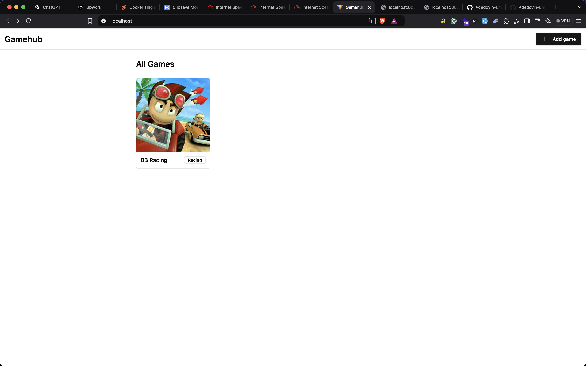

# Game Hub 🎖️

This is a simple fullstack app I built to practise dockerizing a fullstack app. (ReactJs, C# + Dotnet + Mysql Server).

So I've been writing ASP.NET Web API's for months now and I just wanted to play with dockerizing a fullstack app 3 servies. Frontend, Backend and Database. So I built this project. It is a simple project and I majorly focused on the backend.

## What Did I Learn? 🤔

Great question. I learned a lot, I learned docker best practises, choosing the correct image, tagging docker images, permissions, reading logs etc. I am happy I learned this because I can now apply it in a real world application.

On the frontend part, I played with `@tanstack/react-query` it is a beautiful package, I learned how to invalidate a request and trigger an update which kind of eliminates using `State Management Libraries` in a way (some aspect of your app) not totally though. This is because tagging a request and then invalidating that request updates the data and triggers a re-render to all components that subscribed to the request so to speak. I also played with `ShadcnUi` again.

On the backend, I learned how to handle file uploads, validating files, etc. I also learned how to implement `CORS`. Totally awesome. I better understood `DI` Dependency injections and how it helps me write loosely-coupled code which makes testing easier. I also used `AutoMapper` for the first time, I used the `Repository-Pattern` which again makes my code loosely coupled. I also played with the `Servies` approach which is good for delagating work off the `Controller` My file uploader is a `Service`. Overall learned a lot and I'm more comfortable writing `ASP.NET WEB APIS`

## Demo 🧑‍🍳

## Conclusion 🙏

Bottomline, this is just a simple project I can't wait to build complex apps and even dockerize up to 4-5 servies. `Frontend, Backend, Database, Redis` etc. Also if you're reading this and you notice I misplaced letter `n`. Don't judge me. My Laptop Keyboard isn't really good at the moment. I pray I'm able to fix it soon. If you want to follow my `C# journey` You can check my Github repo. Right now, I focused on learning / mastering ASP.NET, DSA, and Docker

<https://github.com/adedoyin-emmanuel/csharp-journey>
